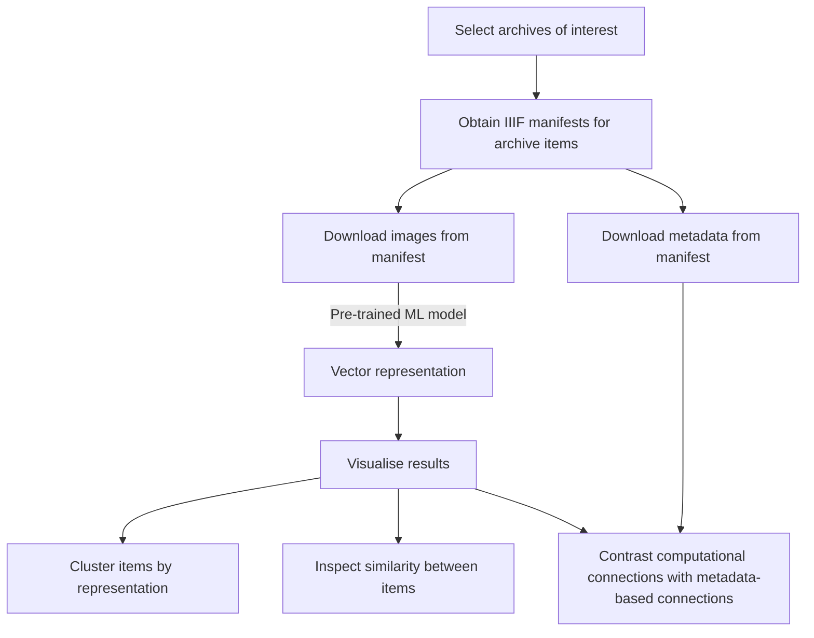

# on2logic
Deep similarity searching of archive manuscripts

This repo contains code for calculating the visual similarity between images by using pre-trained computer vision ML models. We apply this to images downloaded from CUDL IIIF manifests and computationally infer connections between archive items. 

