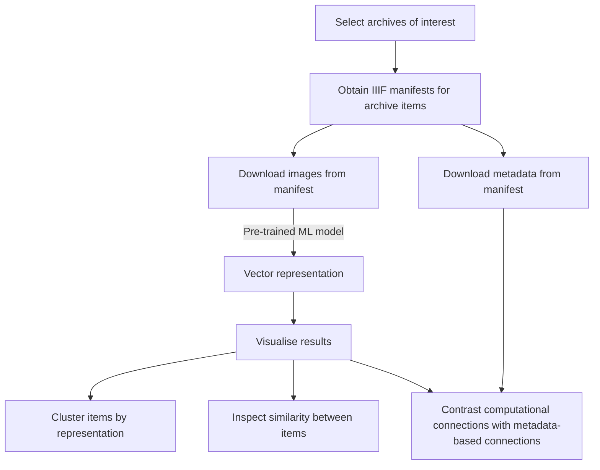

# on2logic

Deep similarity searching of archive manuscripts

This repo contains code for calculating the visual similarity between images by using pre-trained computer vision ML models. We apply this to images downloaded from CUDL IIIF manifests and computationally infer connections between archive items.

## Data Sources and Selection

For this project we selected five different manuscripts in the Cambridge University Library's digital collections that are from similar time periods but are in separate collections.  The idea is to interrogate metadata and categories used to describe manuscripts and incunabula by comparing them to a computer's method of categorising images based on visual similarities.  To that end, we have selected the following manuscripts and incunabula as a case study:

### ʻAjāʼib al-makhlūqāt (MS Nn.3.74)

A manuscript containing a copy of the Persian version of 'The cosmography of Qazwini', dated 1566.  This is from the Islamic Manuscripts Collection.  To view the full manuscript click [here](https://cudl.lib.cam.ac.uk/view/MS-NN-00003-00074/).

### Trilingual compendium of texts (MS Gg.1.1)

A manuscript containing a collection of texts covering a range of scholarly subjects (including scientific, astronomical, theological, etc.), dated c. first half of the 14th century, post 1307.  This is from the Christian Works Collection.   To view the full manuscript click [here](https://cudl.lib.cam.ac.uk/view/MS-GG-00001-00001/).

### Nuremberg Chronicle (Inc.0.A.7.2[888])

An incunabulum comprehensive history of the Christian world from the mythic origins of time to events near-contemporary with the incunabulum, dated 1493.  This is from the Treasures of the Library Collection.   To view the full manuscript click [here](https://cudl.lib.cam.ac.uk/view/PR-INC-00000-A-00007-00002-00888/).

### Ortus sanitatis (Inc.3.A.1.8[37])

An early printed book that contains the first natural history encyclopaedia, dated 1491.  This is from the Treasures of the Library Collection.   To view the full manuscript click [here](https://cudl.lib.cam.ac.uk/view/PR-INC-00003-A-00001-00008-00037/).

### Gulistan of Sa‘di (RAS Persian 258)

A decorative manuscript of the *Gulistan* (Rose Garden) - a poem composed by the Persian poet Sa'di (1203-1292), dated c. 1582-1583.  This is in the Royal Asiatic Society Collection.   To view the full manuscript click [here](https://cudl.lib.cam.ac.uk/view/MS-RAS-00258/).

### Selection Criteria

We selected these manuscripts because we were already aware of several images that were similar to one another across these various manuscripts.  For example, unsurprisingly, astronomical diagrams in both Islamic and Christian manuscripts and incunabula prove to have a marked visual similarity.

||||
|--|--|--|
|MS Nn.3.74|MS Gg.1.1|MS Inc.0.A.7.2[888]|

Likewise, we can compare images of birds in the *Ortus sanitatus* and *Gulistan*.

|||
|--|--|
|Inc.3.A.1.8[37]|RAS Persian 258|

### Data Labels in the GitHub

We currently have a subset of images from these manuscripts stored on our GitHub.  These are a curated selection of pages from the five manuscripts that include images that we have already recognised as being similar to one another (like the examples previously shown).  These images can be found in the **data** folder under **images**.  Images have been sorted into folders by manuscript.  These folder names are:

|MS Shelfmark|Folder Name|
|--|--|
|MS Nn.3.74|astro-islam|
|MS Gg.1.1|astro-christ|
|MS Inc.0.A.7.2[888]|astro-chronicle_nurem|
|Inc.3.A.1.8[37]|natural-history|
|RAS Persian 258|natural-poetry|

Please note these naming conventions are more for our benefit than to indicate anything specific about the texts.  The two  prefixes  'astro' and 'natural' are meant to indicate  which manuscripts are likely to have similar content - i.e. they are likely to have astronomical diagrams or illustrations of wildlife.  The suffixes are meant to broadly indicate what type of text the manuscript is - 'islam' indicating an Islamic text, 'christ' indicating a Christian text, 'history' indicating a 'factual' text (though of course 'history' and 'fact' are not synonymous), and 'poetry' indicating a poetic text.  We recommend that users do not treat these naming conventions as a formal metadata system.

The file names of the images follow a special naming convention.  

1. The manuscript shelfmark is listed first with dashes replacing any spaces and periods, and the numbers  presented in a five-digit format.  
2. This is then followed by '-000-'.
3. The image number is then presented in a five digit format.  

Please note that the image number is not representative of the folio number - the image number instead indicates where the image of the manuscript page appears in the presentation of the full manuscript.  See the example below:

File name: **MS-GG-00001-00001-000-00722.jpg**

Breakdown:
|MS-GG-00001-00001|-000-|00722|.jpg|
|--|--|--|--|
|MS Gg.1.1|break|image 722 (fol. 357v)|jpg file|

### How to Access the Full Data Set

If you would like to access the full data set, there is a Python script available on the GitHub to help you do this.  You can find this script, **get_data.py** in the **data** folder.

To run this script, you need to also download the file **item_list.txt**, which contains the IDs of each of the manuscripts in the data set.

This will download all the associated images of these five manuscripts onto your computer.  This is a grand total of 3,627 images, taking up about 1.3 GB.  Please be aware that the download can take some time.

### TO-DO

[x] - download manifest .csv for case study files
[ ] - implement search via manifests
[ ] - implement app
[ ] - host example app on heroku